# LoveCard_R

このリポジトリは「LoveCard_R」ボードのレイアウト・状態管理・ボタン/ラベル/ゾーン描画を行うフロントエンドアプリケーションです。
Vite + React + TypeScript を利用し、盤面上のゾーンやボタンをグリッドベースで配置し、
コンテキスト経由でゲーム状態を共有します。

## フォルダ構造（tree形式）

```text
.
├─ src/                  # フロントエンドのソースコード一式
│  ├─ app/               # ルートコンポーネント(App.tsx)とアプリ全体の組み立て
│  ├─ board/             # 盤面関連の機能を担当するディレクトリ
│  │  ├─ button/         # ボタン表示・レイアウト・動作（Import/戻る等）
│  │  ├─ deck/           # デッキJSONのパースや型定義
│  │  ├─ label/          # ラベルのレイアウト・表示
│  │  ├─ layout/         # グリッド・ゾーン・ボタンの座標計算とUIコンポーネント
│  │  ├─ state/          # useReducer 用の状態、アクション、セレクター、コンテキスト
│  │  ├─ stage/          # 盤面全体の土台(Stageコンポーネント)
│  │  ├─ zone/           # 各ゾーン(デッキ等)の表示コンポーネント
│  ├─ styles/            # グローバルスタイルやCSS Modules
│  └─ main.tsx           # React エントリーポイント（root へのマウント）
├─ index.html            # Vite のエントリ HTML
├─ package.json          # 依存パッケージとスクリプト
├─ tsconfig*.json        # TypeScript 設定
└─ vite.config.ts        # Vite 設定
```

## モジュール・関数の連結図（Mermaid flowchart）

```mermaid
flowchart TD
    A[main.tsx<br/>ReactDOM.createRoot] --> B[app/App.tsx<br/>Appコンポーネント]
    B --> C[board/state/GameStateContext<br/>GameStateProvider]
    B --> D[board/state/reducer<br/>gameReducer]
    B --> E[board/state/createInitialGameState]
    B --> F[board/layout/grid/grid<br/>createGrid]
    B --> G[board/layout/cardSize<br/>createCardSize]
    B --> H[board/layout/zone/render/zones<br/>zones定義]
    B --> I[board/layout/button/render/buttons<br/>createButtons]
    B --> J[board/layout/label/render/labels<br/>labels定義]
    B --> K[board/layout/zone/zoneFromPoints<br/>zoneFromPoints]
    B --> L[board/layout/button/buttonFromPoints<br/>buttonFromPoints]
    B --> M[board/layout/label/labelFromPoints<br/>labelFromPoints]
    B --> N[board/zone/Deck<br/>Deck表示]
    B --> O[board/layout/zone/ui/ZoneFrame & DeckZoneFrame]
    B --> P[board/layout/button/ui/ButtonFrame]
    B --> Q[board/layout/label/ui/LabelFrame]
    B --> R[board/button/actions/createButtonActions]
    R --> S[board/button/actions/openJsonFile<br/>openTextFile]
    R --> T[board/button/actions/parseDeckJson]
    B --> U[board/state/selectors<br/>selectCardIdsInZone]
```



## 読む順番ガイド

src/main.tsx  
React エントリーポイント。App を root にマウントする流れを把握します。

src/app/App.tsx  
全体の組み立てと状態管理の中心。どのモジュールが組み合わさっているかを理解します。

src/board/state/  
状態の形・遷移・Context 供給の仕組みを把握します。

src/board/layout/grid/ と src/board/layout/cardSize.ts  
グリッド計算とカードサイズ計算の基礎を確認します。

src/board/layout/zone/ button/ label/  
ゾーン・ボタン・ラベルのレイアウト計算と UI の対応を理解します。

src/board/button/actions/ と src/board/deck/  
ボタン動作とデッキ JSON パース処理を確認します。

src/board/zone/  
各ゾーン表示と、状態が画面に反映される流れを確認します。
