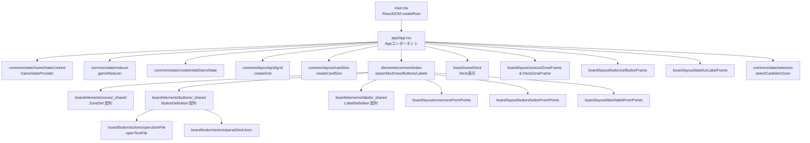

# LoveCard_R

このリポジトリは「LoveCard_R」ボードのレイアウト・状態管理・ボタン/ラベル/ゾーン描画を行うフロントエンドアプリケーションです。
Vite + React + TypeScript を利用し、盤面上のゾーンやボタンをグリッドベースで配置し、
コンテキスト経由でゲーム状態を共有します。

## フォルダ構造（tree形式）

```text
.
├─ src/                      # フロントエンドのソースコード一式
│  ├─ app/                   # ルートコンポーネント(App.tsx)とアプリ全体の組み立て
│  ├─ elements/              # App が利用する組み立て済み要素配列の入口
│  │  └─ common/             # ゾーン/ボタン/ラベル定義に座標計算を適用して返す assemble 系ユーティリティ
│  ├─ common/                # レイアウト・状態管理の共通ユーティリティ
│  │  ├─ layout/             # グリッド座標計算とカードサイズなど共通レイアウト計算
│  │  └─ state/              # GameState 型、reducer、Context、セレクター、初期化処理
│  ├─ board/                 # 盤面関連の機能を担当するディレクトリ
│  │  ├─ elements/           # ゾーン/ボタン/ラベルのレイアウトと表示定義をフォルダ単位で管理し、_shared で配列連結
│  │  │  ├─ zones/           # ゾーンの layout/renderer をゾーン別フォルダで管理
│  │  │  ├─ buttons/         # ボタンの layout/renderer/action をボタン別フォルダで管理
│  │  │  └─ labels/          # ラベルの layout/renderer をラベル別フォルダで管理
│  │  ├─ button/             # ボタン表示コンポーネントと Import 系ユーティリティ
│  │  ├─ deck/               # デッキJSONのパースや型定義
│  │  ├─ label/              # ラベルの枠計算やプレゼンテーションコンポーネント
│  │  ├─ layout/             # ゾーン枠やボタン/ラベルの座標計算とUIコンポーネント
│  │  ├─ stage/              # 盤面全体の土台(Stageコンポーネント)
│  │  ├─ zone/               # 各ゾーン(デッキ等)の表示コンポーネント
│  ├─ styles/                # グローバルスタイルやCSS Modules
│  └─ main.tsx               # React エントリーポイント（root へのマウント）
├─ index.html            # Vite のエントリ HTML
├─ package.json          # 依存パッケージとスクリプト
├─ tsconfig*.json        # TypeScript 設定
└─ vite.config.ts        # Vite 設定
```

## モジュール・関数の連結図（Mermaid flowchart）



## 読む順番ガイド

src/main.tsx  
React エントリーポイント。App を root にマウントする流れを把握します。

src/app/App.tsx  
全体の組み立てと状態管理の中心。どのモジュールが組み合わさっているかを理解します。

src/elements/common/  
assembleZones/assembleButtons/assembleLabels で座標計算済みの配列を返す入口。App との接続点として、どの定義が連結されるかを確認します。

src/common/state/  
状態の形・遷移・Context 供給の仕組みを把握します。

src/common/layout/grid/ と src/common/layout/cardSize.ts  
グリッド計算とカードサイズ計算の基礎を確認します。

src/board/layout/zone/ button/ label/  
ゾーン・ボタン・ラベルのレイアウト計算と UI の対応を理解します。

src/board/button/actions/ と src/board/deck/  
ボタン動作とデッキ JSON パース処理を確認します。

src/board/zone/  
各ゾーン表示と、状態が画面に反映される流れを確認します。
